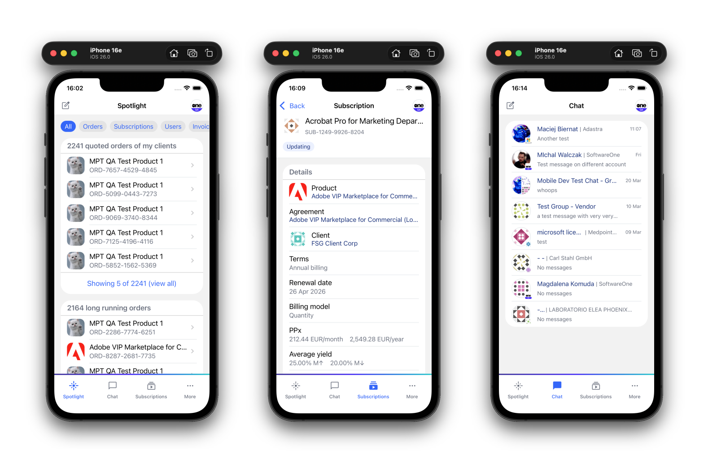

# SoftwareONE Marketplace Mobile

The mobile companion for [SoftwareONE Marketplace](https://portal.platform.softwareone.com/home) — manage your cloud subscriptions, orders, invoices, and agreements on the go. Built with React Native and Expo for iOS and Android.



## Overview

The SoftwareONE Marketplace Mobile App is a native iOS and Android companion to the SoftwareONE Marketplace web portal, giving enterprise users full visibility and control over their cloud subscription lifecycle — anytime, anywhere.

### The Challenge

Enterprise teams managing cloud subscriptions, invoices, and vendor relationships through the SoftwareONE Marketplace needed a way to stay on top of critical tasks without being tied to a desktop. Overdue invoices, expiring subscriptions, pending orders, and user approvals required immediate attention — but the web portal alone couldn't provide the on-the-go accessibility that modern business demands.

### The Solution

We built a cross-platform mobile application (single codebase, native performance on iOS & Android) that brings the full power of the Marketplace to users' pockets. Key capabilities include:

- **Spotlight Dashboard** — A personalized task hub surfacing real-time alerts: overdue invoices, expiring subscriptions, pending orders, and user invitations requiring action.
- **Subscription & Order Management** — Browse, review, and track cloud subscriptions, orders, products, and agreements on the go.
- **Billing & Finance** — Access invoices, credit memos, statements, and journal entries with full document detail.
- **Integrated Chat** — Communicate directly with support and marketplace participants without leaving the app.
- **Administration** — Manage users, buyers, sellers, licensees, programs, and enrollments from a single interface.
- **Multi-Account Switching** — Instantly switch between accounts without re-authenticating — critical for resellers and partners managing multiple organizations.
- **Passwordless Authentication** — Secure, frictionless login via email and one-time code (Auth0).

### Technology

Built with **React Native** (New Architecture) and **Expo**, the app delivers native performance from a single TypeScript codebase. Real-time updates are powered by **SignalR**, server state by **TanStack React Query**, and analytics by **Azure Application Insights**. The codebase enforces strict quality gates (≥ 80% test coverage, automated linting, E2E testing with Appium) and ships through CI/CD pipelines to both app stores.

### Impact

The app empowers enterprise teams — resellers, finance, administrators, and support staff — to act on time-sensitive tasks the moment they arise, reducing response times and improving operational efficiency across the SoftwareONE partner ecosystem.

## ⬇️ Getting Started

You'll need **Node.js 20+** and either **Xcode** (iOS) or **Android Studio** (Android).

```bash
git clone <repository-url>
cd mpt-mobile-platform

# Set up environment
cp app/.env.example app/.env
# Fill in Auth0 credentials — grab them from Keeper Vault or ask a teammate

# Install and run
cd app
npm install
npm run ios       # or: npm run android
```

That's it. The app should launch in your simulator.

> **Changed `.env` values?** Clear the Metro cache with `npx expo start --clear`, then rebuild.

##  Development Scripts

Run from the **repository root**. npm commands run from `app/`.

```bash
# Quick start
./scripts/hot-reload.sh              # Dev server with hot reload (press i/a/r)
./scripts/deploy-ios.sh --verbose    # Full iOS Simulator build + deploy

# Build
npm run ios                          # iOS Simulator
npm run android                      # Android emulator

# Quality
npm test                             # Unit tests
npm run lint                         # Lint check
npm run lint:fix                     # Auto-fix lint errors

# Cleanup
./scripts/cleanup.sh                 # Clean build artifacts
./scripts/cleanup.sh --deep          # Nuclear option (removes node_modules)

# E2E
./scripts/run-local-test.sh --platform ios welcome
./scripts/run-local-test.sh --platform android --build all
```

## 🔄 CI/CD

GitHub Actions handle validation and builds automatically.

| Workflow | Trigger | Duration |
|----------|---------|----------|
| **PR Build** | Pull request to `main` | ~2–5 min |
| **Main CI** | Push to `main` | ~25–35 min |
| **iOS / Android Build** | Auto on `main` + manual | ~15–30 min |
| **TestFlight** | Manual only | ~30–45 min |

Every push to `main` runs lint + tests, then builds iOS and Android artifacts in parallel. TestFlight deployment is manual — see the [Deployment Guide](.github/DEPLOYMENT_GUIDE.md) for the full test → QA → prod promotion flow, and [TestFlight Setup](.github/TESTFLIGHT_SETUP.md) for secrets and first-time configuration.

## 💬 Contributing

We welcome contributions! Here's the quick version:

1. Branch off `main`: `feature/MPT-XXXX/short-description`
2. Read [CONVENTIONS.md](CONVENTIONS.md) — it's enforced on every PR
3. Write tests for new code
4. Open a PR with a [Conventional Commits](https://www.conventionalcommits.org/) title (e.g., `feat: add biometric login`)
5. Wait for CI to go green (lint, tests, [SonarCloud](https://sonarcloud.io/project/overview?id=softwareone-pc_mpt-mobile-platform-v2) quality gate)

Found a bug or have an idea? [Open an issue](../../issues) — we'd love to hear from you.

## 📖 Documentation

| Topic | Link |
|-------|------|
| Coding conventions | [CONVENTIONS.md](CONVENTIONS.md) |
| Design system | [app/src/styles/README.md](app/src/styles/README.md) |
| Logging | [documents/LOGGING.md](documents/LOGGING.md) |
| iOS local build | [documents/LOCAL_BUILD_IOS.md](documents/LOCAL_BUILD_IOS.md) |
| Android local build | [documents/LOCAL_BUILD_ANDROID.md](documents/LOCAL_BUILD_ANDROID.md) |
| E2E testing (iOS) | [documents/APPIUM_IOS_TESTING.md](documents/APPIUM_IOS_TESTING.md) |
| E2E testing (Android) | [documents/APPIUM_ANDROID_TESTING.md](documents/APPIUM_ANDROID_TESTING.md) |
| E2E testing (Android on Windows) | [documents/APPIUM_ANDROID_TESTING_WINDOWS.md](documents/APPIUM_ANDROID_TESTING_WINDOWS.md) |
| Writing E2E tests | [documents/EXTENDING_TEST_FRAMEWORK.md](documents/EXTENDING_TEST_FRAMEWORK.md) |
| Test element identification | [documents/TEST_ELEMENT_IDENTIFICATION_STRATEGY.md](documents/TEST_ELEMENT_IDENTIFICATION_STRATEGY.md) |
| Zscaler Android emulator setup | [documents/ZSCALER_ANDROID_EMULATOR_SETUP.md](documents/ZSCALER_ANDROID_EMULATOR_SETUP.md) |
| Deployment guide (test/QA/prod) | [.github/DEPLOYMENT_GUIDE.md](.github/DEPLOYMENT_GUIDE.md) |
| TestFlight setup | [.github/TESTFLIGHT_SETUP.md](.github/TESTFLIGHT_SETUP.md) |
| Copilot review setup | [.github/COPILOT_REVIEW_SETUP.md](.github/COPILOT_REVIEW_SETUP.md) |

## ⚖️ License

Licensed under the [Apache License 2.0](LICENSE).

---

Built with ❤️ by the [SoftwareONE](https://www.softwareone.com/) Marketplace team.
